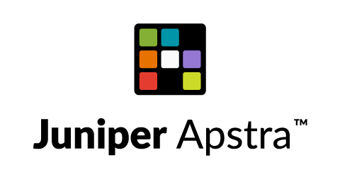

<!-- Improved compatibility of back to top link: See: https://github.com/othneildrew/Best-README-Template/pull/73 -->
<a name="readme-top"></a>
<!--
*** Thanks for checking out the Best-README-Template. If you have a suggestion
*** that would make this better, please fork the repo and create a pull request
*** or simply open an issue with the tag "enhancement".
*** Don't forget to give the project a star!
*** Thanks again! Now go create something AMAZING! :D
-->


<!-- PROJECT SHIELDS -->
<!--
*** I'm using markdown "reference style" links for readability.
*** Reference links are enclosed in brackets [ ] instead of parentheses ( ).
*** See the bottom of this document for the declaration of the reference variables
*** for contributors-url, forks-url, etc. This is an optional, concise syntax you may use.
*** https://www.markdownguide.org/basic-syntax/#reference-style-links
-->
[![Contributors][contributors-shield]][contributors-url]
[![Forks][forks-shield]][forks-url]
[![Stargazers][stars-shield]][stars-url]
[![Issues][issues-shield]][issues-url]

[![LinkedIn][linkedin-shield]][linkedin-url]


<!-- PROJECT LOGO -->
<br />
<div align="center">
  <a href="https://github.com/Juniper-SE/apstra-freeform">
    
  </a>

<h3 align="center">Freeform Collections</h3>

  <p align="center">
    Config Templates and Property Sets for Juniper Apstra Freeform
    <br />
    <a href="https://www.juniper.net/documentation/product/us/en/apstra/"><strong>Explore the Juniper Apstra Docs »</strong></a>
    <br />
    <br />
    <a href="https://cloudlabs.apstra.com/">Start your own Demo</a>
    ·
    <a href="https://github.com/Juniper-SE/apstra-freeform/issues">Report Bug</a>
    ·
    <a href="https://github.com/Juniper-SE/apstra-freeform/issues">Request Feature</a>
  </p>
</div>


<!-- ABOUT THE PROJECT -->
## About The Project

[Juniper Apstra](https://www.juniper.net/us/en/products/network-automation/apstra.html)

Welcome to the github repo for Apstra Freeform! We hope to capture a wide variety of config templates with Jinja2 templating, property_sets and other info to build out different Freeform Topologies with Juniper Apstra.  We welcome your contributions and hope this can be a public repo we can all share.

<p align="right">(<a href="#readme-top">back to top</a>)</p>


### Built With

* Jinja2

<p align="right">(<a href="#readme-top">back to top</a>)</p>


<!-- GETTING STARTED -->
## Getting Started

You can just clone this repo and then use the different Config Templates and Property Sets with Freeform. To get a local copy up and running follow these simple example steps.

### Prerequisites

A running version of Juniper Apstra with Freeform > v4.1.1 [Download](https://support.juniper.net/support/downloads/?p=apstra)


### Installation

1. Clone the repo
   ```sh
   git clone https://github.com/Juniper-SE/apstra-freeform.git
   ```

<p align="right">(<a href="#readme-top">back to top</a>)</p>


<!-- USAGE EXAMPLES -->
## Usage

Use this space to show useful examples of how a project can be used. Additional screenshots, code examples and demos work well in this space. You may also link to more resources.

_For more examples, please refer to the [Documentation](https://www.juniper.net/us/en/products/network-automation/apstra.html)_

<p align="right">(<a href="#readme-top">back to top</a>)</p>


<!-- ROADMAP -->
## Roadmap

- [ ] Add Additional network designs


See the [open issues](https://github.com/Juniper-SE/apstra-freeform/issues) for a full list of proposed features (and known issues).

<p align="right">(<a href="#readme-top">back to top</a>)</p>


<!-- CONTRIBUTING -->
## Contributing

Contributions are what make the open source community such an amazing place to learn, inspire, and create. Any contributions you make are **greatly appreciated**.

If you have a suggestion that would make this better, please fork the repo and create a pull request. You can also simply open an issue with the tag "enhancement".
Don't forget to give the project a star! Thanks again!

1. Fork the Project
2. Create your Feature Branch (`git checkout -b feature/AmazingFeature`)
3. Commit your Changes (`git commit -m 'Add some AmazingFeature'`)
4. Push to the Branch (`git push origin feature/AmazingFeature`)
5. Open a Pull Request

<p align="right">(<a href="#readme-top">back to top</a>)</p>


<!-- CONTACT -->
## Contact

Bill Wester  - bwester@juniper.net

Project Link: [https://github.com/Juniper-SE/apstra-freeform](https://github.com/Juniper-SE/apstra-freeform)

<p align="right">(<a href="#readme-top">back to top</a>)</p>


<!-- MARKDOWN LINKS & IMAGES -->
<!-- https://www.markdownguide.org/basic-syntax/#reference-style-links -->
[contributors-shield]: https://img.shields.io/github/contributors/Juniper-SE/apstra-freeform.svg?style=for-the-badge
[contributors-url]: https://github.com/Juniper-SE/apstra-freeform/graphs/contributors
[forks-shield]: https://img.shields.io/github/forks/Juniper-SE/apstra-freeform.svg?style=for-the-badge
[forks-url]: https://github.com/Juniper-SE/apstra-freeform/network/members
[stars-shield]: https://img.shields.io/github/stars/Juniper-SE/apstra-freeform.svg?style=for-the-badge
[stars-url]: https://github.com/Juniper-SE/apstra-freeform/stargazers
[issues-shield]: https://img.shields.io/github/issues/Juniper-SE/apstra-freeform.svg?style=for-the-badge
[issues-url]: https://github.com/Juniper-SE/apstra-freeform/issues
[license-shield]: https://img.shields.io/github/license/Juniper-SE/apstra-freeform.svg?style=for-the-badge
[license-url]: https://github.com/Juniper-SE/apstra-freeform/blob/master/LICENSE.txt
[linkedin-shield]: https://img.shields.io/badge/-LinkedIn-black.svg?style=for-the-badge&logo=linkedin&colorB=555
[linkedin-url]: https://linkedin.com/in/billwester/
[product-screenshot]: images/screenshot.png
[Next.js]: https://img.shields.io/badge/next.js-000000?style=for-the-badge&logo=nextdotjs&logoColor=white
[Next-url]: https://nextjs.org/
[React.js]: https://img.shields.io/badge/React-20232A?style=for-the-badge&logo=react&logoColor=61DAFB
[React-url]: https://reactjs.org/
[Vue.js]: https://img.shields.io/badge/Vue.js-35495E?style=for-the-badge&logo=vuedotjs&logoColor=4FC08D
[Vue-url]: https://vuejs.org/
[Angular.io]: https://img.shields.io/badge/Angular-DD0031?style=for-the-badge&logo=angular&logoColor=white
[Angular-url]: https://angular.io/
[Svelte.dev]: https://img.shields.io/badge/Svelte-4A4A55?style=for-the-badge&logo=svelte&logoColor=FF3E00
[Svelte-url]: https://svelte.dev/
[Laravel.com]: https://img.shields.io/badge/Laravel-FF2D20?style=for-the-badge&logo=laravel&logoColor=white
[Laravel-url]: https://laravel.com
[Bootstrap.com]: https://img.shields.io/badge/Bootstrap-563D7C?style=for-the-badge&logo=bootstrap&logoColor=white
[Bootstrap-url]: https://getbootstrap.com
[JQuery.com]: https://img.shields.io/badge/jQuery-0769AD?style=for-the-badge&logo=jquery&logoColor=white
[JQuery-url]: https://palletsprojects.com/p/jinja/ 
